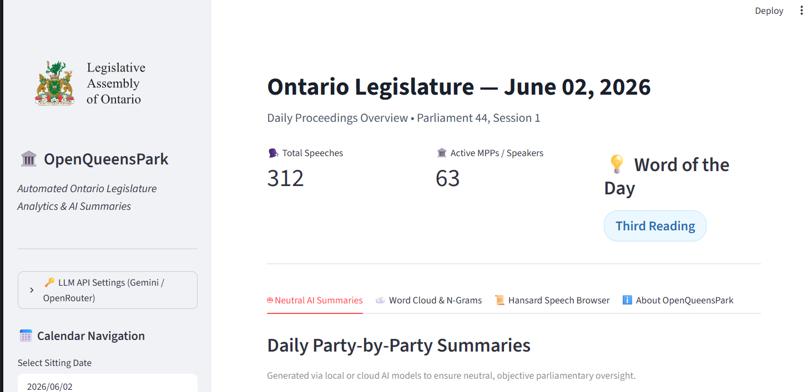

OpenQueensPark is a civic‑tech Streamlit app that gives an automated, non‑partisan daily overview of proceedings in the Ontario Legislature. The pipeline (Python) scrapes or fetches Hansard transcripts, stores structured records in SQLite (runs locally on a Raspberry Pi), and generates party‑by‑party summaries via free LLM APIs (e.g., OpenRouter). Custom tokenization (ngram_iterator) produces daily word clouds and a "Word of the Day", while the Streamlit front end provides calendar navigation and interactive visualizations for tracking provincial political discourse.

Live demo: https://openqueenspark.streamlit.app/

